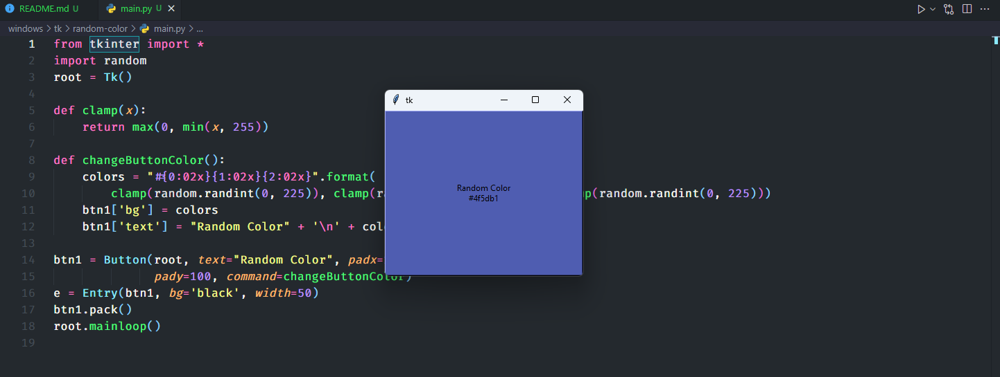

# Tkinter
Tkinter là một giao diện Python chuẩn đến bộ công cụ giao diện người dùng Tcl/Tk. Tkinter cho phép bạn tạo các ứng dụng GUI đa nền tảng.

## Project

### Random color

Source: [random-color](random-color)

### Game tic tac toe

Source: [game-xo](game-xo)

